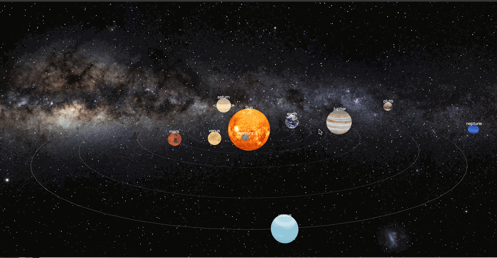
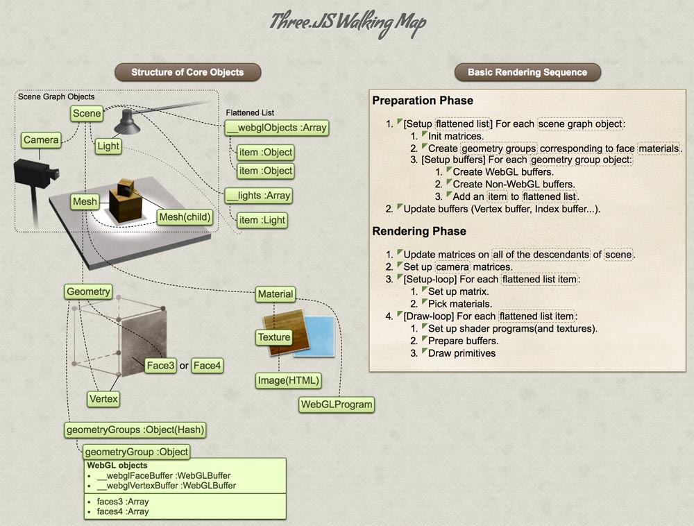
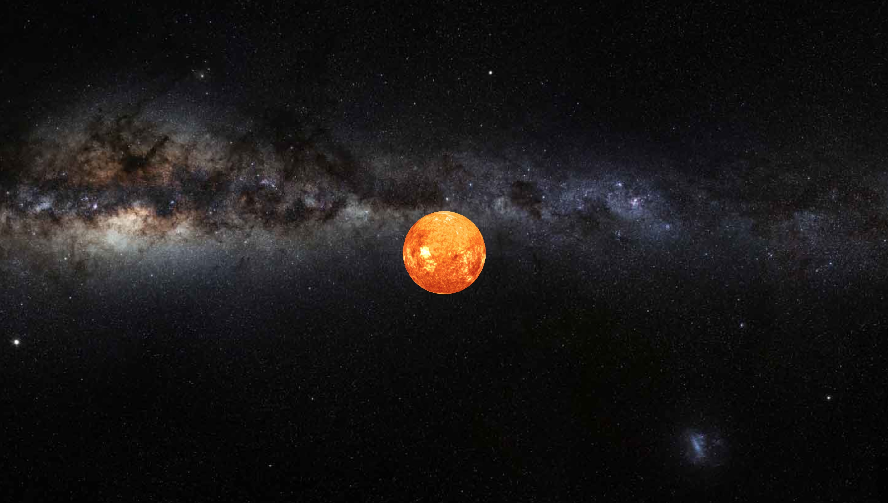
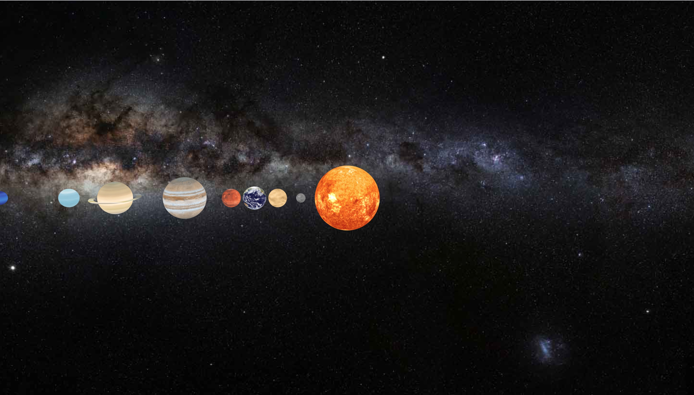

# 260行代码，用Threejs实现一个太阳系(附源码)

当初学习3D的时候，我看的是彭国伦编著的《3D绘图程序设计》。书里面有一个项目例子是实现一个太阳系模拟仿真系统，等把系统开发完，三维知识也就基本入门了。不过书中采用的是OpenGL和Direct3D，配置开发环境和开发有一定的门槛。自从进入社会搬砖之后，工作都是围绕前端，再加上现在浏览器性能非常强大，就用Three.js（一个webGL库）把这个太阳系重新实现了一遍，写篇文章记录一下。

预览地址：https://www.manylesson.com/solar/

源代码下载：https://github.com/iWun/solar-system



>WebGL（Web Graphics Library）是一种3D绘图协议，这种绘图技术标准允许把JavaScript和OpenGL ES 2.0结合在一起，为HTML5 Canvas提供硬件3D加速渲染，这样就可以借助系统显卡来在浏览器里更流畅地展示3D场景。由于WebGL 只是非常基础的绘图 API（需要编程人员有很深厚的高等数学，图形学原理方面的积累，而且代码量巨大），实际开发中会借助WebGL库。而Three.js就是一个用Javascript编写的，可以跑在浏览器上的第三方库。它降低了3D开发的门槛，同时大大提升了效率。



从上图可以看出，一个典型的Three.js程序包括场景（Scene），相机（Camera），渲染器（Render），光照（Light），网格（Mesh）。

## 开始动手

1. 准备一张画布，画布的背景是银河系。

```
const canvas = document.getElementById('main');

/*画布大小*/
canvas.width = window.innerWidth;
canvas.height = window.innerHeight;
```


2. 首先添加一个场景，场景是我们将要渲染的三维空间，相机，光照，网格...等都必须要添加到场景中。

```
/*scene*/
const scene = new THREE.Scene();
```

3. 场景中添加一个相机，相机用来确定观察位置、方向、角度，相机决定了最终渲染到屏幕上的内容。

```
/*camera*/
const camera = new THREE.PerspectiveCamera(45, window.innerWidth / window.innerHeight, 1, 3000);
camera.position.set(-200, 50, 0);
camera.lookAt(new THREE.Vector3(0, 0, 0));
scene.add(camera);
```

4. 准备渲染器，开始对场景进行渲染

```
/*renderer*/
const renderer = new THREE.WebGLRenderer({
  canvas,
  alpha: true,
  antialias: true
});
```

5. 添加网格（Mesh）

到目前为止，场景还是空的。我们先添加一个太阳。在 Three.js 中，网格（Mesh）由几何体（Geometry）和材质（Material）两部分组成，几何体决定了网格的轮廓形状（比如一个物体是方的，圆的，还是扁的），而材质决定了网格的材料和质感（比如一个物体表面是光滑还是粗糙，是金属质感还是木质）。

```
/*sun*/
const sunMaterial = new THREE.MeshBasicMaterial({
  map: loader.load('./img/sun_bg.jpg')
});
const Sun = new THREE.Mesh(new THREE.SphereGeometry(14, 30, 30), sunMaterial);
Sun.name = 'Sun';
SunSystem.add(Sun);
```



6. 用同样的方式添加地球和其他行星，添加完之后是这样的（注：这里为了展示效果，参数没有按照实际的距离和星球大小）。



7. 让太阳系动起来

地球等行星在自转的同时，还在围绕太阳公转。下一步是想办法让太阳系动起来。跟前端实现动画的思路一致，基本方法还是调用[`requestAnimationFrame`](https://developer.mozilla.org/en-US/docs/Web/API/window/requestAnimationFrame)方法，以每秒60次（60帧）的频率执行重绘（render）。而在`render`方法内部我们可以改变行星的位置（position），体态（rotation）。这样就可以让整个太阳系动起来。

```
function render(time) {
  time *= 0.0005;

  SunSystem.rotation.y = -time;
  for (var i = 0; i < planets.length; i++) {
    planets[i].rotation.y -= planets[i].speed;
    const planet = planets[i].children[0];
    planet.rotation.y -= 0.1;
  }

  orbitcontrols.update();

  renderer.render(scene, camera);
  labelRenderer.render(scene, camera);

  requestAnimationFrame(render);
}
```


8. 公转轨道

注意看，为了方便观察，我们给图上的每个行星都添加了一个公转轨道，这里是利用Three.js的`RingGeometry`实现的。土星的光环也是利用同样的方法，只不过是加载了纹理材质。

```
const track = new THREE.Mesh(new THREE.RingGeometry(position, position + 0.05, 64, 1), new THREE.MeshBasicMaterial({
  side: THREE.DoubleSide
}));
track.rotation.x = - Math.PI / 2;
scene.add(track);
```

9. 利用`BufferGeometry`实现满天繁星

目前实现的太阳系已经“有模有样”了。为了更加逼真，我们再添加银河系的星星作为背景，大概有**10万颗**。
但是10万个几何体对浏览器来说是一个巨大的消耗，浏览器运行不一会了就崩了。
Three.js对于这种极端情况的处理，推荐使用`BufferGeometry`


>BufferGeometry uses named BufferAttributes. Each BufferAttribute represents an array of one type of data: positions, normals, colors, and uv. Together, the added BufferAttributes represent parallel arrays of all the data for each vertex.

`BufferGeometry`使用相对复杂，详细可以参考[这篇文章]('https://threejsfundamentals.org/threejs/lessons/threejs-custom-buffergeometry.html')，源代码[在这里](https://github.com/iWun/solar-system)

```
const particleNum = 100000; 

const bufferGeometry = new THREE.BufferGeometry();
const positions = new Float32Array(particleNum * 3);
const colors = new Float32Array(particleNum * 3);
```

10. End

happy coding, enjoy life.